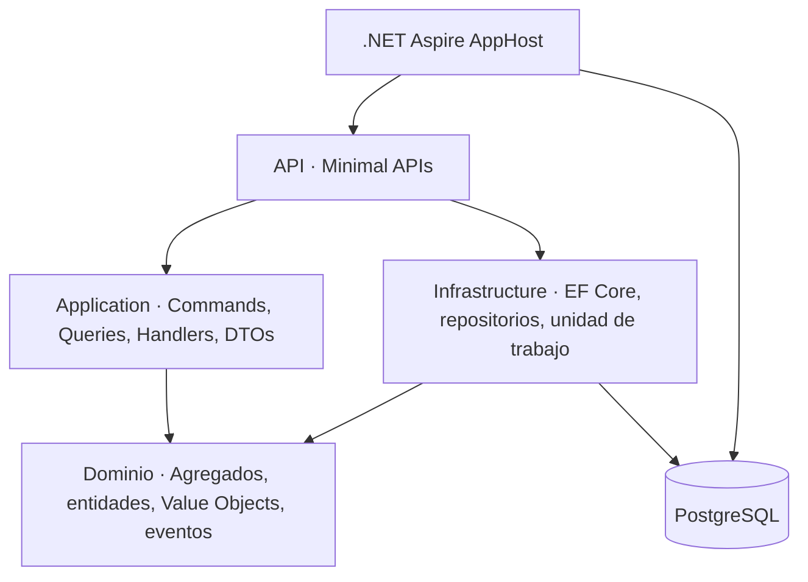
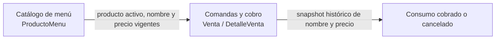
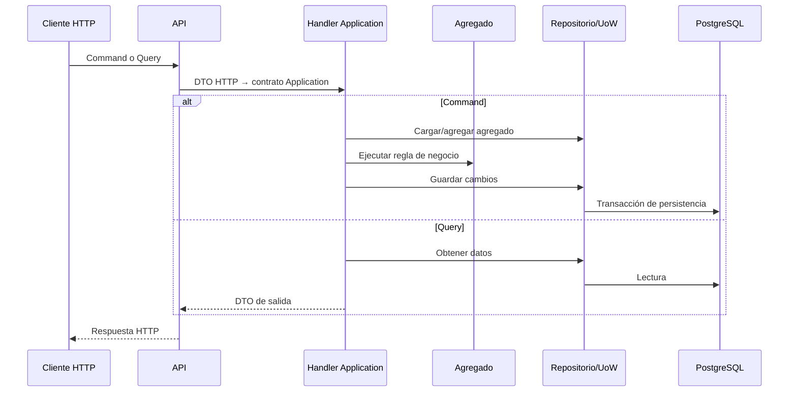

# RestauranteVentas

Sistema de gestión de consumo y cobro para un restaurante, construido como un monolito modular en .NET 10. El proyecto usa DDD para proteger las reglas de negocio, CQRS para separar intención de cambio y lectura, PostgreSQL para persistencia y .NET Aspire para la experiencia local y las pruebas de integración.

> **Nota de lenguaje:** el agregado se llama `Venta` en el código y en la API. Mientras está en estado `Abierta`, su semántica de negocio es la de una **comanda abierta**: puede recibir, modificar o quitar líneas. Al pagarse, representa el consumo cobrado. El nombre público se conserva para no introducir una ruptura de contrato prematura.

## Alcance

El sistema cubre:

- Catálogo básico de productos de menú.
- Apertura de una venta/comanda con mesa y cliente opcionales.
- Registro, modificación y eliminación de detalles.
- Cobro único mediante efectivo, tarjeta o transferencia.
- Cancelación de una venta abierta.
- Conservación del nombre y precio que tenían los productos al agregarse.

Quedan fuera de alcance deliberadamente: inventario, reservas, cocina, delivery, promociones, facturación tributaria, gestión integral de clientes, autenticación y autorización. No son omisiones accidentales: no se añadieron reglas ficticias para aparentar un dominio más grande.

## Estado de la solución

| Capacidad | Estado documentado |
|---|---|
| Modelo de dominio | Agregados `Venta` y `ProductoMenu`, entidades internas, Value Objects e invariantes de ciclo de vida. |
| Clean Architecture | Dominio independiente; Application define casos de uso; Infrastructure implementa persistencia; API compone y expone HTTP. |
| CQRS | Commands, queries y handlers separados; las queries usan puertos de lectura con proyecciones EF Core `AsNoTracking` a DTOs. |
| Eventos de dominio | Las entidades registran eventos y EF Core los persiste en una outbox dentro de la misma confirmación de cambios. |
| Persistencia | EF Core 10 + PostgreSQL + migraciones. |
| Operación local | AppHost de Aspire, PostgreSQL, pgAdmin, health checks y `ServiceDefaults`. |
| Pruebas | Verificación final desde una base limpia: **95/95** (62 Dominio, 22 Application, 4 arquitectura y 7 integración). |

## Arquitectura



Las dependencias permitidas apuntan hacia el núcleo:

- `Dominio` no referencia otros proyectos ni dependencias técnicas.
- `Aplicacion` referencia únicamente `Dominio` y expresa los puertos necesarios.
- `Infrastructure` implementa repositorios, puertos de lectura, unidad de trabajo y adaptadores técnicos de reloj/identidad.
- `Api` traduce HTTP a casos de uso y registra dependencias.
- `AppHost` orquesta recursos locales; no contiene reglas de negocio.

El detalle completo está en [Arquitectura](docs/arquitectura.md) y el vocabulario e invariantes en [Modelo de dominio](docs/modelo-dominio.md).

## Contextos delimitados



Son contextos delimitados dentro de un mismo proceso. No son microservicios: se despliegan y evolucionan juntos mientras el problema no justifique distribución.

## Reglas de negocio principales

- La moneda es USD y los importes/cantidades/números de mesa válidos son positivos.
- Una venta se crea abierta; puede no tener cliente ni mesa.
- Solo una venta abierta admite cambios de detalles.
- Para pagar se requiere al menos un detalle y un método de pago válido.
- Una venta pagada o cancelada es terminal y no admite nuevas modificaciones.
- Un producto inactivo no puede agregarse.
- El total se deriva de los detalles; no se persiste ni asigna manualmente como una entrada independiente.
- Cada detalle guarda el nombre y el precio unitario históricos del producto, de modo que el menú puede cambiar sin alterar consumos anteriores.
- Las fechas de creación, pago y cancelación son instantes UTC válidos; pago y cancelación deben ser posteriores a la creación.
- Una cancelación requiere motivo no vacío, normalizado, de hasta 500 caracteres, y conserva su fecha para auditoría.

Consulte las reglas, estados y decisiones de nomenclatura en [docs/modelo-dominio.md](docs/modelo-dominio.md).

## CQRS, sin promesas exageradas



CQRS aquí significa separar operaciones de cambio (`Commands`) y operaciones de lectura (`Queries`) en contratos y handlers distintos. Los comandos trabajan con agregados; las queries usan puertos de lectura e implementaciones EF Core que proyectan a DTOs con `AsNoTracking`. No implica, por sí mismo, dos bases de datos, Event Sourcing, MediatR ni microservicios. La situación y evolución del modelo de lectura se explican en [docs/arquitectura.md](docs/arquitectura.md).

## Eventos de dominio y outbox

`Venta` registra eventos al crearse, pagarse o cancelarse. Al confirmar una unidad de trabajo, el `DbContext` persiste mensajes de outbox junto con el cambio de estado y limpia los eventos del agregado solo después de guardar con éxito. `ProcesadorOutbox` reclama los mensajes con token y lease, deja una auditoría estructurada y marca éxito o programa reintento. La entrega es al menos una vez y el efecto actual es local; no se afirma un broker ni integración externa inexistentes.

Véase [Eventos y outbox](docs/arquitectura.md#eventos-de-dominio-y-outbox) y el ADR correspondiente en [docs/adr/0004-eventos-y-outbox.md](docs/adr/0004-eventos-y-outbox.md).

## Estructura del repositorio

```text
src/
├── RestauranteVentas.Dominio/          # Modelo y reglas de negocio puras
├── RestauranteVentas.Aplicacion/       # Casos de uso CQRS, contratos y DTOs
├── RestauranteVentas.Infrastructure/   # EF Core, PostgreSQL, repositorios y UoW
└── RestauranteVentas.Api/              # Minimal APIs y composición

RestauranteVentas.AppHost/              # Orquestación Aspire
RestauranteVentas.ServiceDefaults/      # Telemetría y health checks compartidos
tests/
├── RestauranteVentas.Dominio.Tests/
├── RestauranteVentas.Aplicacion.Tests/
└── RestauranteVentas.IntegrationTests/
docs/
├── adr/
└── http/
```

## Requisitos

- SDK de .NET 10.
- Docker Desktop iniciado para Aspire y las pruebas de integración.
- La CLI de Aspire si se usará `aspire start`. Las pruebas no necesitan que el AppHost esté iniciado manualmente.

## Inicio rápido

Restaure y ejecute la suite completa desde la raíz:

```powershell
dotnet restore RestauranteVentas.slnx
dotnet test RestauranteVentas.slnx --configuration Release
```

Para levantar el entorno local con Aspire:

```powershell
aspire start --apphost RestauranteVentas.AppHost/RestauranteVentas.AppHost.csproj --non-interactive
aspire wait api --non-interactive
```

Al estar saludable, abra la URL de la API mostrada por Aspire y navegue a `/swagger` en entorno Development. Para detener el entorno:

```powershell
aspire stop --non-interactive
```

Los ejemplos HTTP ejecutables están en [docs/http/productos.http](docs/http/productos.http) y [docs/http/ventas.http](docs/http/ventas.http). Ajuste `@baseUrl` al puerto expuesto por Aspire si no usa el perfil local predeterminado.

## Pruebas y verificación desde una base limpia

La verificación final registrada el 28 de julio de 2026 ejecutó 95/95 casos correctos:

| Proyecto | Tipo | Casos |
|---|---|---:|
| `RestauranteVentas.Dominio.Tests` | Unitarias de reglas, eventos y Value Objects | 62 |
| `RestauranteVentas.Aplicacion.Tests` | Unitarias de handlers, commands y queries | 22 |
| `RestauranteVentas.Arquitectura.Tests` | Dependencias permitidas entre capas | 4 |
| `RestauranteVentas.IntegrationTests` | AppHost + PostgreSQL + API | 7 |
| **Total** |  | **95** |

Las integraciones crean el AppHost mediante `Aspire.Hosting.Testing` con `UseVolumes=false`; por ello validan un PostgreSQL efímero, aplican la migración al iniciar la API y no reutilizan el volumen persistente normal del entorno local. Docker debe estar iniciado.

La misma verificación final confirmó compilación sin advertencias ni errores, ausencia de cambios de modelo pendientes en EF Core y cierre del AppHost al terminar las integraciones.

La guía de diagnóstico y la limpieza explícita de datos locales están en [docs/operacion-y-pruebas.md](docs/operacion-y-pruebas.md). Borrar un volumen es destructivo y no debe hacerse sobre datos que deban conservarse.

## Migraciones

En entorno `Development`, la API ejecuta las migraciones al inicio para facilitar desarrollo y demostración local. Esa elección no sustituye un proceso de despliegue controlado en producción. Para inspeccionar el modelo durante desarrollo:

```powershell
dotnet tool restore
$env:RESTAURANTEVENTAS_CONNECTION_STRING = "Host=localhost;Port=5432;Database=restauranteventas;Username=postgres;Password=<password>"
dotnet tool run dotnet-ef migrations has-pending-model-changes --project src/RestauranteVentas.Infrastructure --context RestauranteVentasDbContext
```

## Documentación de apoyo

- [Arquitectura y flujos](docs/arquitectura.md)
- [Modelo de dominio](docs/modelo-dominio.md)
- [Operación local, migraciones y pruebas](docs/operacion-y-pruebas.md)
- [Contrato HTTP](docs/api.md)
- [Decisiones arquitectónicas (ADRs)](docs/adr/README.md)
- [Guía de defensa](docs/guia-defensa.md)

## Calidad continua

El repositorio incluye [`.editorconfig`](.editorconfig) para convenciones de codificación y [el workflow de CI](.github/workflows/ci.yml). En cada `push` y pull request, el workflow restaura, compila en `Release`, verifica Docker, ejecuta las pruebas de la solución y recoge cobertura en formato Cobertura. Esto incluye las integraciones de Aspire; no son pruebas que dependan de una base compartida del desarrollador.

## Transparencia técnica

La documentación diferencia capacidades implementadas de decisiones objetivo. La outbox transaccional, las proyecciones `AsNoTracking` y la concurrencia optimista deben tener siempre pruebas que respalden su afirmación. Aún requieren una decisión explícita antes de declararse completas: idempotencia de comandos HTTP e integración externa de los eventos más allá de la auditoría local. Esta distinción es intencional: una defensa sólida explica lo que el sistema hace hoy y no atribuye patrones que no estén implementados y probados.
