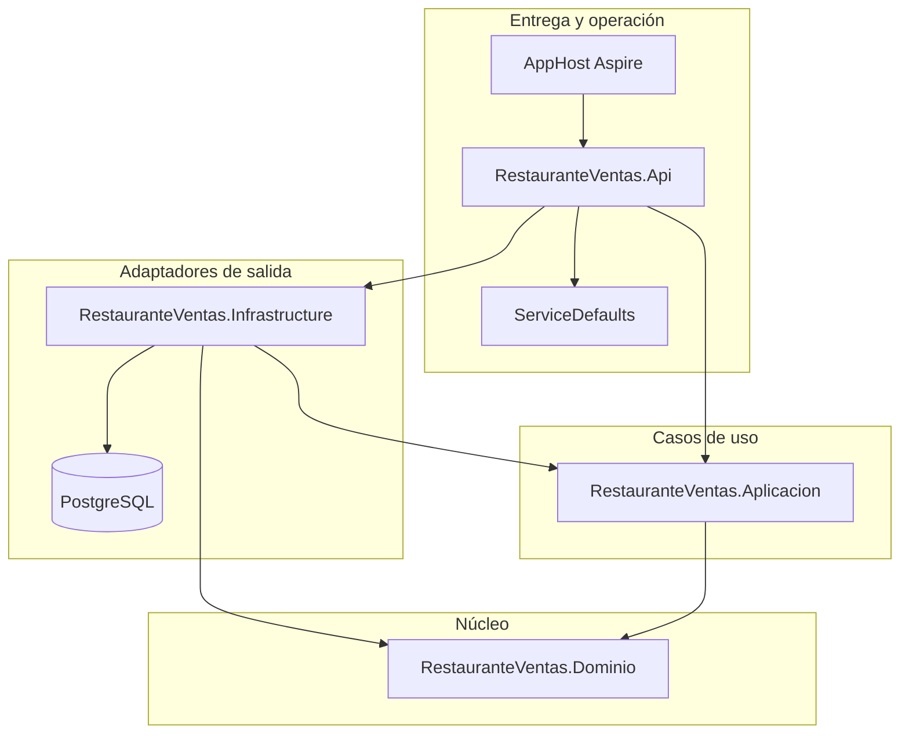
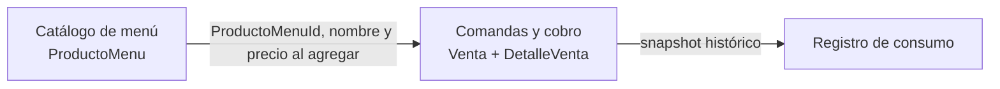
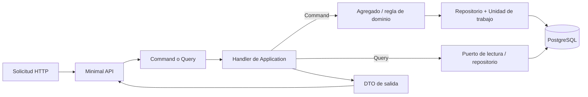
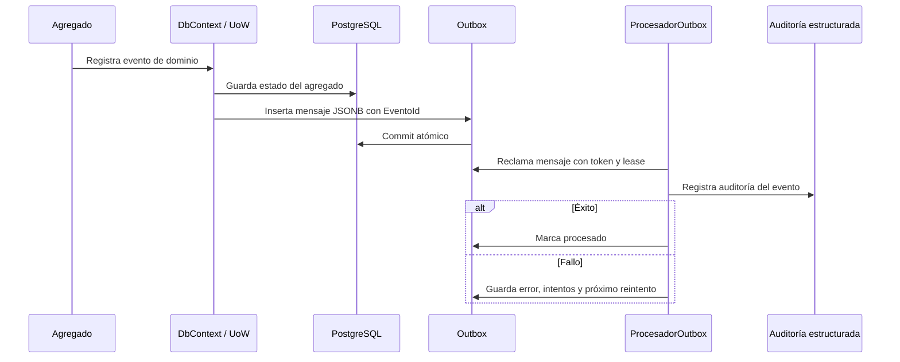

# Arquitectura

## Propósito

El proyecto utiliza un monolito modular con Clean Architecture. La prioridad es proteger las reglas del dominio de las decisiones de transporte, base de datos y orquestación local, manteniendo una complejidad proporcional al problema.

## Límites y dependencias

| Proyecto | Responsabilidad | No debe contener |
|---|---|---|
| `Dominio` | Agregados, entidades, Value Objects, reglas y eventos de dominio. | EF Core, HTTP, logging, acceso a configuración o dependencias de infraestructura. |
| `Aplicacion` | Commands, queries, handlers, DTOs, puertos y orquestación de casos de uso. | Reglas que pertenezcan al agregado o detalles de EF/HTTP. |
| `Infrastructure` | DbContext, configuraciones EF, repositorios, puertos de lectura, unidad de trabajo, reloj, generador de identidad, outbox y procesador en segundo plano. | Decisiones HTTP o reglas de negocio duplicadas. |
| `Api` | Enlaces HTTP, serialización, composición de dependencias y códigos de respuesta. | Lógica de dominio o consultas SQL embebidas. |
| `AppHost` | PostgreSQL, API, health checks y experiencia local con Aspire. | Modelo de negocio. |

La regla que se puede defender es: las decisiones técnicas dependen del núcleo, nunca al revés.

## Contextos delimitados

### Catálogo de menú

Administra la existencia, nombre, precio vigente y disponibilidad de un `ProductoMenu`. Es un agregado independiente porque tiene un ciclo de vida propio.

### Comandas y cobro

Administra una `Venta` que, en estado `Abierta`, se comporta como una comanda: agrega, modifica o elimina detalles; después se paga o cancela. No administra el ciclo de vida del catálogo. Cuando se agrega una línea, copia nombre y precio para conservar el hecho histórico.

### Fuera de los límites

Inventario, reservas, cocina, delivery, facturación tributaria y CRM no forman parte del modelo. Incluirlos sin reglas reales borraría los límites del ejercicio.

## Flujo CQRS

### Estado de implementación de CQRS

- Los contracts `IComando`, `IConsulta` y sus handlers separan intenciones de escritura y lectura.
- Los comandos cargan o crean agregados, ejecutan métodos del dominio y persisten mediante la unidad de trabajo.
- Las queries usan `IVentaLectura` e `IProductoMenuLectura`, implementados por EF Core en Infrastructure.
- Las implementaciones de lectura proyectan directamente a DTOs y usan `AsNoTracking`; no reconstruyen el agregado de escritura solo para responder un `GET`.
- Se conserva una sola base PostgreSQL. CQRS no exige dos bases de datos ni consistencia eventual.

## Transacción de escritura

1. El endpoint traduce el body HTTP a un command.
2. El handler obtiene los agregados necesarios mediante interfaces del dominio.
3. El agregado valida sus invariantes y devuelve un resultado explícito.
4. El handler usa la unidad de trabajo para confirmar los cambios.
5. La API traduce el resultado a una respuesta HTTP.

Las reglas permanecen dentro de `Venta` y `ProductoMenu`; el handler no decide si una venta puede pagar o si un producto puede agregarse.

`IReloj` e `IGeneradorIdentidad` son puertos de Application. Sus implementaciones reales (`RelojSistema` y `GeneradorIdentidadGuid`) viven en Infrastructure y se registran allí, de modo que la creación de una venta y las transiciones temporales puedan controlarse en pruebas sin acoplar Application a servicios técnicos concretos.

## Eventos de dominio y outbox

Un evento de dominio describe un hecho que el propio dominio ya aceptó, por ejemplo una venta creada, pagada o cancelada. No equivale automáticamente a un mensaje publicado hacia otro proceso.

### Implementación actual

`Entidad` conserva eventos en memoria y `Venta` registra hechos al crear, pagar o cancelar. Cuando `RestauranteVentasDbContext.SaveChanges[Async]` confirma cambios, detecta las entidades agregadas o modificadas que tienen eventos y crea un `OutboxMensaje` por evento:

- El `EventoId` es la clave primaria del mensaje y evita duplicación dentro de la unidad de trabajo.
- El tipo, payload JSONB, fecha de ocurrencia y fecha de creación quedan persistidos junto con el estado del agregado.
- Los eventos del agregado se limpian únicamente después de que `SaveChanges` termina correctamente.
- Si falla la persistencia, los eventos continúan en el agregado y los mensajes siguen tracked para que no se pierda el hecho al reintentar.

`ProcesadorOutbox` es un `BackgroundService` local que lee mensajes pendientes en lotes, los reclama de forma atómica con token y lease temporal, emite una auditoría estructurada y los marca como procesados. Si falla el consumo, guarda el error, incrementa intentos y programa un reintento con backoff. El efecto actual del consumidor es la auditoría por log; no hay un broker ni una integración externa declarada.

### Flujo transaccional y de consumo

La entrega es **al menos una vez**. Un proceso puede caer después de producir un efecto y antes de marcar el mensaje como procesado; por eso `EventoId` es estable y cualquier consumidor futuro debe ser idempotente. El token/lease evita que dos instancias procesen simultáneamente el mismo mensaje, pero no transforma la entrega en exactamente una vez.

Consulte [ADR 0004](adr/0004-eventos-y-outbox.md) para el criterio de adopción y su estado.

## Persistencia y consistencia

- EF Core mapea los agregados hacia PostgreSQL mediante configuraciones explícitas.
- Los detalles pertenecen a la venta y se cargan para que el agregado pueda aplicar sus reglas.
- El snapshot de producto evita que un cambio de menú altere un consumo histórico.
- Las restricciones PostgreSQL complementan al dominio: valores positivos, estados/métodos válidos, fechas coherentes y consistencia de transiciones.
- `Venta` usa la columna de sistema PostgreSQL `xmin` como token de concurrencia optimista. EF Core la incluye en actualizaciones y elimina escrituras desactualizadas.
- La unidad de trabajo traduce `DbUpdateConcurrencyException` a `ConflictoConcurrenciaException`; la API responde `409 Conflict` sin exponer detalles internos.

La concurrencia optimista y la idempotencia de comandos son aspectos distintos. La primera está implementada para `Venta`; la segunda evita repetir un mismo efecto lógico cuando el cliente reintenta una solicitud. La API todavía no ofrece una llave de idempotencia HTTP, por lo que no debe confundirse el control `xmin` con idempotencia.

## Operación con Aspire

El AppHost declara PostgreSQL, pgAdmin y la API. La API espera que la base esté disponible y publica un health check `/health`. Además registra `AddDbContextCheck<RestauranteVentasDbContext>("postgresql", tags: ["ready"])`: `/health` comprueba readiness incluyendo PostgreSQL, mientras `/alive` es un liveness ligero. `ServiceDefaults` concentra los elementos transversales habituales de Aspire —telemetría, health checks y configuración compartida— sin contaminar el dominio.

En entorno local, Aspire puede persistir PostgreSQL en el volumen `restauranteventas-postgres-data`. Las pruebas de integración pasan `UseVolumes=false` para levantar una base efímera y aislada.
