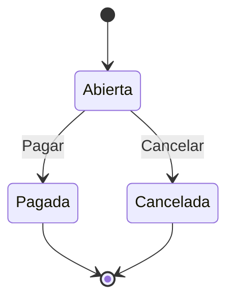
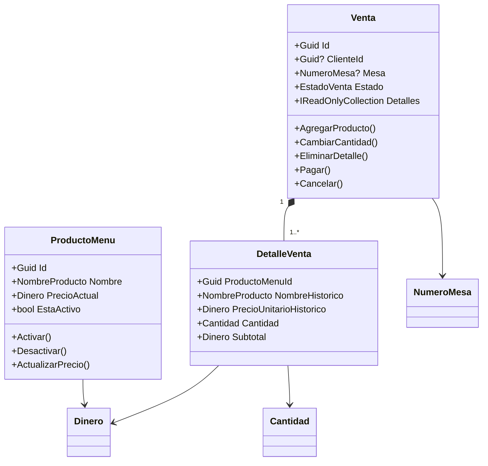

# Modelo de dominio — RestauranteVentas

## Objetivo

Gestionar las ventas del restaurante mediante un núcleo de dominio puro que encapsula las reglas de negocio, los estados de una venta y los eventos relevantes del ciclo de vida.

## Entidades

| Entidad | Descripción |
|---------|-------------|
| **Venta** | Agregado principal. Representa una venta con detalles, estado, fechas y método de pago. |
| **DetalleVenta** | Línea de una venta con nombre y precio históricos del producto. |
| **ProductoMenu** | Producto del menú con nombre, precio actual y estado activo/inactivo. |

## Value Objects

| Value Object | Regla |
|--------------|-------|
| **Dinero** | Monto mayor que cero; moneda USD. Permite sumar y multiplicar por cantidad. |
| **Cantidad** | Entero mayor que cero. |
| **NumeroMesa** | Entero mayor que cero. |
| **NombreProducto** | No vacío; longitud máxima 100 caracteres. |

## Reglas de negocio

1. Una venta puede no tener mesa, cliente o ambos.
2. La moneda usada es **USD**.
3. Una venta debe contener por lo menos un detalle para poder pagarse.
4. Una venta **abierta** permite agregar, cambiar o eliminar detalles.
5. Una venta **pagada** no puede modificarse ni cancelarse.
6. Una venta **cancelada** no puede modificarse ni pagarse.
7. Cada detalle conserva el **nombre** y **precio unitario histórico** del producto.
8. Un producto **inactivo** no puede agregarse a una venta nueva.
9. El precio debe ser positivo y la cantidad mayor que cero.
10. El **total** se calcula desde los detalles; nunca se asigna manualmente.
11. Una venta se paga en una sola operación: **efectivo**, **tarjeta** o **transferencia**.
12. Al crear, pagar o cancelar una venta se produce un **evento de dominio**.

## Estados permitidos de una venta

- **Abierta**: admite modificaciones de detalles y puede pagarse o cancelarse.
- **Pagada**: estado final; no admite más cambios.
- **Cancelada**: estado final; no admite pago ni modificaciones.

## Eventos de dominio

| Evento | Cuándo se registra |
|--------|-------------------|
| `VentaCreadaEventoDominio` | Al crear una venta exitosamente. |
| `VentaPagadaEventoDominio` | Al pagar una venta exitosamente. |
| `VentaCanceladaEventoDominio` | Al cancelar una venta exitosamente. |

Cada evento incluye al menos `VentaId` y `FechaUtc`.

## Sin dependencias externas

El proyecto `RestauranteVentas.Dominio` **no referencia** otros proyectos ni paquetes NuGet. Las abstracciones (`Entidad`, `IEventoDominio`, `Resultado`, `Error`) y las reglas de negocio viven íntegramente en el dominio, lo que permite que Application, Infrastructure, API y Aspire se conecten sobre un núcleo estable y probado.

## Diagrama de clases

