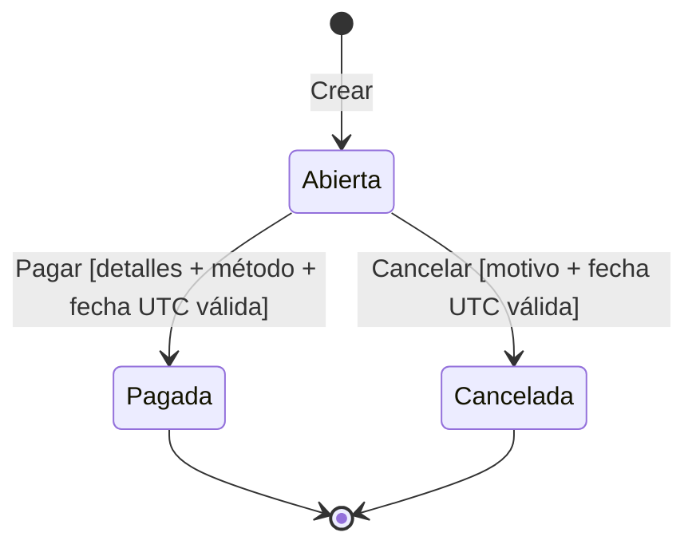
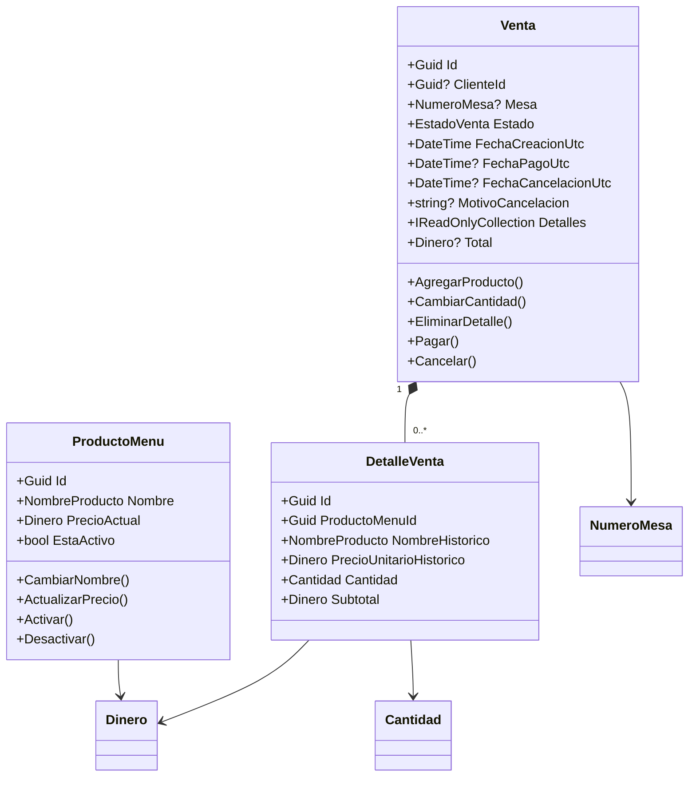

# Modelo de dominio

## Lenguaje ubicuo

| Término | Significado en este proyecto |
|---|---|
| **Venta abierta** | Nombre público del agregado mientras el consumo está en curso. Semánticamente equivale a una **comanda abierta**. |
| **Venta pagada** | La misma venta después de un cobro definitivo; representa el consumo cerrado. |
| **Detalle de venta** | Línea interna de la venta que conserva producto, nombre, precio y cantidad del consumo. |
| **Producto de menú** | Elemento del catálogo con precio vigente y disponibilidad. |
| **Snapshot histórico** | Copia de nombre y precio del producto que se guarda en el detalle al agregarlo. |
| **Pago** | Transición única de `Abierta` a `Pagada` mediante un método válido. |
| **Cancelación** | Transición única de `Abierta` a `Cancelada`, con fecha y motivo auditables. |

El nombre `Venta` se conserva en las clases, rutas y DTOs actuales. No significa que se esté modelando una venta ya cobrada desde el primer momento: la máquina de estados representa explícitamente la comanda en curso.

## Agregados y entidades

| Tipo | Rol | Responsabilidad |
|---|---|---|
| `Venta` | Aggregate root | Controla detalles, estados, pago, cancelación, total y eventos de su ciclo de vida. |
| `DetalleVenta` | Entidad interna | Tiene identidad propia porque su cantidad puede cambiar individualmente. No se modifica fuera de `Venta`. |
| `ProductoMenu` | Aggregate root | Controla nombre, precio actual y estado activo/inactivo del catálogo. |

`Venta` comienza con **cero o más** detalles. El requisito de tener al menos una línea aplica al pago, no a la creación. Por esa razón sería incorrecto declarar una relación obligatoria `1..*` desde el momento de apertura.

## Value Objects

| Value Object | Invariante |
|---|---|
| `Dinero` | Monto mayor que cero; moneda fija USD; operaciones de suma y multiplicación controladas. |
| `Cantidad` | Entero mayor que cero. |
| `NumeroMesa` | Entero mayor que cero. |
| `NombreProducto` | No vacío y con máximo de 100 caracteres. |

Estos tipos no poseen identidad propia. Evitan que valores primitivos inválidos se propaguen hasta el agregado.

## Invariantes implementadas

### Creación

- El identificador de venta no puede ser `Guid.Empty`.
- `ClienteId` es opcional; si se proporciona, no puede ser `Guid.Empty`.
- La fecha de creación debe ser UTC y distinta de `default(DateTime)`.
- Mesa es opcional; cuando existe, la valida `NumeroMesa`.
- La venta se crea siempre en estado `Abierta` y registra `VentaCreadaEventoDominio`.

### Detalles

- Solo una venta `Abierta` puede agregar, cambiar cantidad o eliminar un detalle.
- Producto y cantidad son obligatorios.
- Un producto inactivo no puede agregarse.
- Cada detalle toma `ProductoMenuId`, `NombreHistorico` y `PrecioUnitarioHistorico` al agregarlo.
- El total es derivado de los detalles; con cero detalles es `null` y no un importe que el cliente pueda asignar manualmente.

La implementación actual agrega una línea por cada solicitud de agregar producto. Cualquier consolidación de productos repetidos o protección contra reintentos HTTP debe modelarse y probarse explícitamente; no se asume de forma implícita.

### Pago

- Solo puede pagarse una venta abierta con al menos un detalle.
- El método debe ser `Efectivo`, `Tarjeta` o `Transferencia`.
- La fecha de pago debe ser UTC, distinta de `default(DateTime)` y estrictamente posterior a `FechaCreacionUtc`.
- El pago conserva `MetodoPago`, `FechaPagoUtc` y registra `VentaPagadaEventoDominio` con el total y método de pago.

### Cancelación

- Una venta pagada no puede cancelarse; una cancelada no puede volver a cancelarse ni modificarse.
- La fecha de cancelación debe ser UTC, distinta de `default(DateTime)` y estrictamente posterior a `FechaCreacionUtc`.
- El motivo es obligatorio, se recorta, no puede quedar vacío y su longitud máxima es 500 caracteres.
- Se persisten `FechaCancelacionUtc` y `MotivoCancelacion` como parte de la auditoría de negocio.
- La transición registra `VentaCanceladaEventoDominio` con motivo y fecha.

## Estados

```mermaid
stateDiagram-v2
    [*] --> Abierta: Crear
    Abierta --> Pagada: Pagar [detalles + método + fecha UTC válida]
    Abierta --> Cancelada: Cancelar [motivo + fecha UTC válida]
    Pagada --> [*]
    Cancelada --> [*]
```

| Estado | Cambios permitidos | Datos finales |
|---|---|---|
| `Abierta` | Agregar, cambiar y eliminar detalles; pagar; cancelar. | Puede no tener detalles ni total. |
| `Pagada` | Ninguno. | Método, fecha de pago y total histórico. |
| `Cancelada` | Ninguno. | Fecha y motivo de cancelación. |

## Eventos de dominio

| Evento | Hecho descrito | Datos relevantes |
|---|---|---|
| `VentaCreadaEventoDominio` | Se abrió una venta/comanda. | `EventoId`, `VentaId`, `FechaCreacionUtc`, `OcurridoEnUtc`. |
| `VentaPagadaEventoDominio` | Se cerró mediante cobro. | `EventoId`, `VentaId`, `Total`, `MetodoPago`, `FechaPagoUtc`, `OcurridoEnUtc`. |
| `VentaCanceladaEventoDominio` | Se canceló una comanda abierta. | `EventoId`, `VentaId`, `MotivoCancelacion`, `FechaCancelacionUtc`, `OcurridoEnUtc`. |

Cada evento tiene un `EventoId` estable para permitir consumidores idempotentes y un instante UTC de ocurrencia. El mecanismo de persistencia/despacho de esos eventos se documenta en [Arquitectura](arquitectura.md#eventos-de-dominio-y-outbox); registrar un evento y publicarlo de forma confiable son responsabilidades distintas.

## Diagrama de clases

```mermaid
classDiagram
    class Venta {
        +Guid Id
        +Guid? ClienteId
        +NumeroMesa? Mesa
        +EstadoVenta Estado
        +DateTime FechaCreacionUtc
        +DateTime? FechaPagoUtc
        +DateTime? FechaCancelacionUtc
        +string? MotivoCancelacion
        +IReadOnlyCollection Detalles
        +Dinero? Total
        +AgregarProducto()
        +CambiarCantidad()
        +EliminarDetalle()
        +Pagar()
        +Cancelar()
    }

    class DetalleVenta {
        +Guid Id
        +Guid ProductoMenuId
        +NombreProducto NombreHistorico
        +Dinero PrecioUnitarioHistorico
        +Cantidad Cantidad
        +Dinero Subtotal
    }

    class ProductoMenu {
        +Guid Id
        +NombreProducto Nombre
        +Dinero PrecioActual
        +bool EstaActivo
        +CambiarNombre()
        +ActualizarPrecio()
        +Activar()
        +Desactivar()
    }

    class Dinero
    class Cantidad
    class NumeroMesa

    Venta "1" *-- "0..*" DetalleVenta
    DetalleVenta --> Dinero
    DetalleVenta --> Cantidad
    Venta --> NumeroMesa
    ProductoMenu --> Dinero
```

## Decisiones y límites

- No hay inventario, reservas ni facturación tributaria dentro de este modelo.
- Un producto de menú es independiente de los detalles históricos; cambiar el catálogo no reescribe ventas anteriores.
- La elección de una sola comanda abierta por mesa no es una invariante implementada actualmente. Si el negocio la exige, necesita una regla transaccional y prueba de concurrencia, no solo una validación en memoria.
